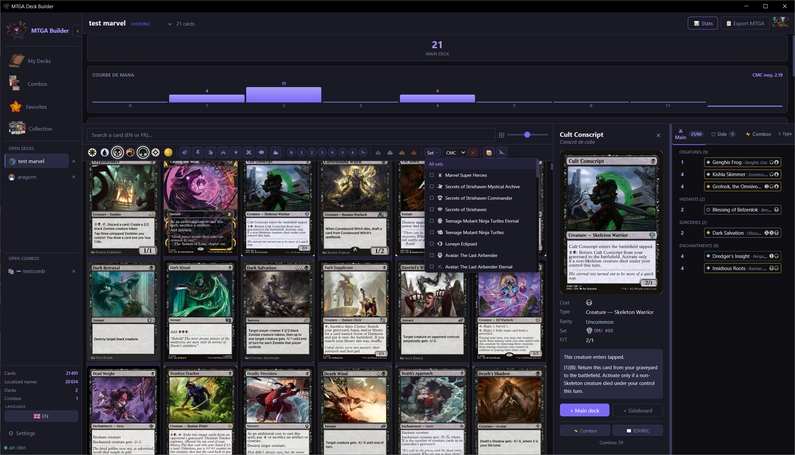
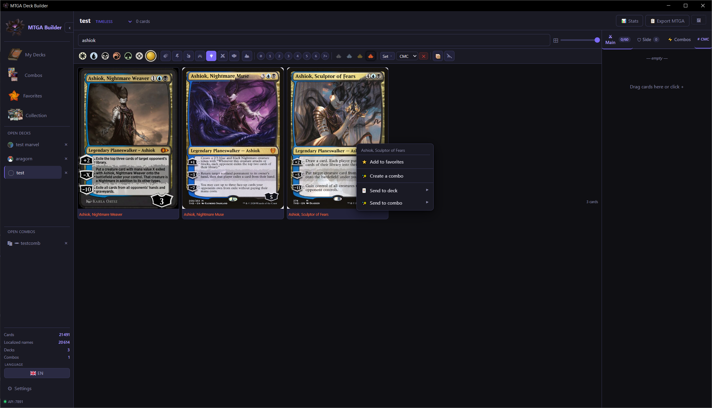
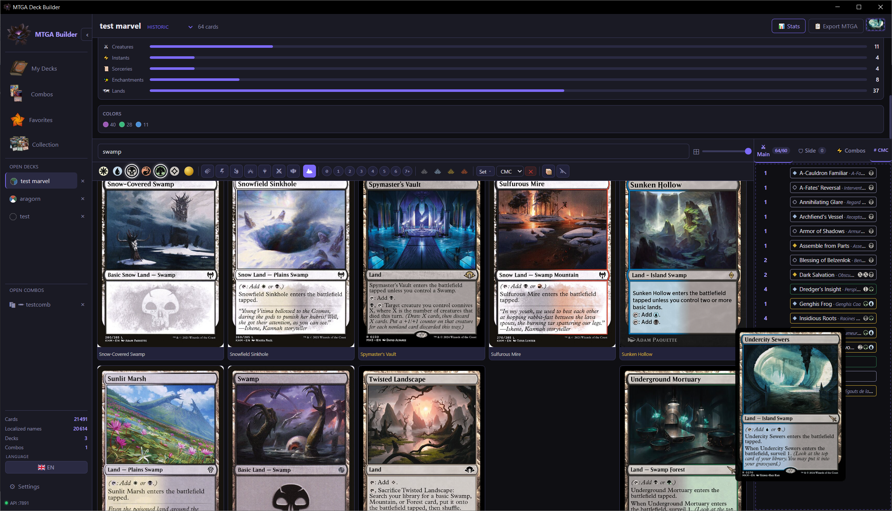
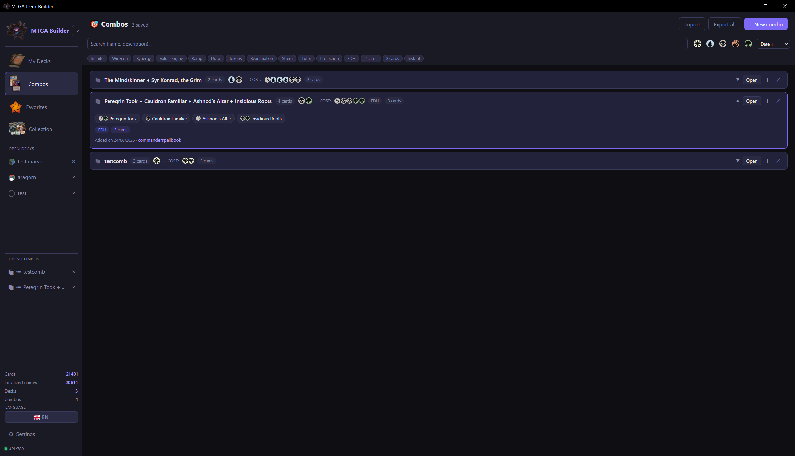
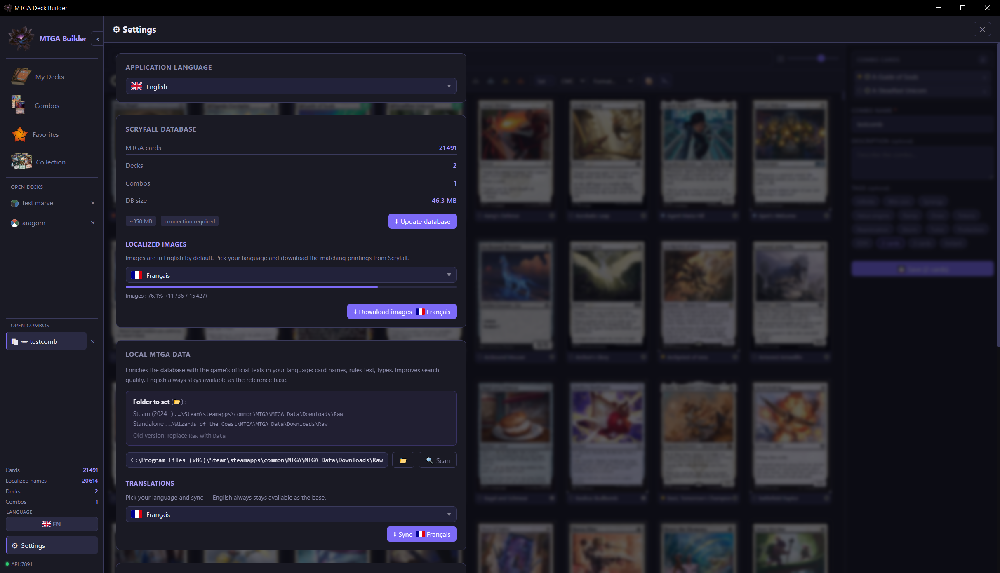

<div align="center">

# 🪷 MTGA Deck Builder

**The companion deck builder for MTG Arena — everything Arena does, plus the tools it's missing.**

[English](README.md) · [Français](README.fr.md)


### [⬇️ Download the latest version](https://github.com/Zipoj/mtga-deck-builder/releases/latest)

</div>

---

## ✨ Overview

Build Magic: The Gathering Arena decks from the cards you **actually own** — entirely on your machine, no account, no cloud.

<!-- SCREENSHOT: main deck builder view -->
<p align="center"></p>

## Features

### The basics — everything you'd expect from Arena

- 🃏 **Deck builder** with drag & drop, mana curve, type/color breakdown and full deck statistics
- 📦 **Collection view** synced from your local MTG Arena data — see exactly what you own
- 🔍 Powerful card search with format, color, type, rarity and set filters
- 🔄 Double-faced card support (flip view)

### What the builder adds on top

- 📤 **Import & export** your decks freely — move lists in and out as text, share them, back them up
- ♾️ **No deck limit** — Arena caps you at 100 decks; here you can keep as many as you want and grow a far bigger library
- 🔗 **Combos** browser with import/export
- ⭐ **Favorites** management
- 🔎 **Independent search & filters per tab** — each tab keeps its own search and filter state, so switching around never resets what you were looking at
- 💾 **Optional persistence** — reopen the app exactly where you left off, with the same decks and views open
- 🌍 **Multilingual card data** — independent language settings for card text and card images (11 languages)
- 🖥️ **Localized interface** (11 languages)
- 🎨 **Themes** (6 presets, custom accent color, multiple fonts)
- 🧩 Companion browser extension (ComboTGA) integration via a local REST API

## 🖼️ A look around

<p align="center"></p>
<p align="center"><em>Powerful search with format, color, type, rarity and set filters — plus right-click actions to favorite, send to a deck or build a combo.</em></p>

<p align="center"></p>
<p align="center"><em>Build with drag & drop while live stats (mana curve, colors, types) update at the top.</em></p>

<p align="center"></p>
<p align="center"><em>The combos browser — organize, tag, import and export your favorite interactions.</em></p>

## 🚀 Installation

1. Go to the [**latest release**](https://github.com/Zipoj/mtga-deck-builder/releases/latest) and download **`MTGA Deck Builder_1.0.0_x64-setup.exe`**.
2. Run the installer and follow the assistant.
3. If **Windows SmartScreen** appears (the app is unsigned), click **More info** → **Run anyway**.

> 💡 Two formats are available: the `-setup.exe` installer (recommended) and a `.msi` package.

## 📖 First-time setup — building your card database

The app ships empty: you build your local card database in a few guided steps from the **Settings** page. Do them in order the first time.

<p align="center"></p>

### 1. Download the card database (required)

Pull the full card data from **Scryfall**. This is the foundation — names, costs, types, oracle text and English images for every card. Settings → **Update database**.

### 2. Download localized images (optional)

If you want card artwork in another language, fetch the localized images for the language of your choice. Settings → **Localized images**. Purely cosmetic — skip it if you're happy with English art.

### 3. Sync MTG Arena data — translations & missing cards

Point the app at your local MTG Arena data folder and run the sync. This does two important things:

- **Localized card text** in the language of the raw file (names, types, oracle text).
- **Unlocks very recent cards** that Scryfall lists but hasn't yet tagged for Arena (an Arena-ID backfill). These cards exist in Scryfall's data but stay hidden until your Arena files confirm you can actually get them — the sync reveals them.

It also makes **search work in both English and your chosen language at the same time**, so you can find a card by either name.

> **English users:** the sync is per-language, so just pick any language (e.g. French) to run it — your English names are **never overwritten**. Simply keep the **LOC button on EN** and the app stays fully in English, while search still benefits from the unlocked cards and works in both languages.

### 4. Sync your collection

With **MTG Arena running**, sync your collection so the builder knows exactly which cards — and how many — you own. Settings → **Sync collection**.

## 🌐 The LOC button

The **LOC** button (top bar) flips card text and images between **English** and your selected language on the fly. Toggle it on to read everything localized; toggle it back to **EN** to see the original English — your data stays intact either way.

## 🧩 Browser extension — *coming soon*

A companion browser extension (**ComboTGA**) talks to the builder through a local REST API to bring combo data right into your browser. The **Firefox** and **Opera** versions are **ready and currently awaiting store review** — links will be added here as soon as they're approved.

## 🛠️ Build from source

Requirements: [Node.js](https://nodejs.org/), [Rust](https://www.rust-lang.org/tools/install) and the [Tauri prerequisites](https://tauri.app/start/prerequisites/).

```bash
npm install          # install frontend dependencies
npm run tauri dev    # run the app in development
npm run tauri build  # build a release installer
```

**Tech stack:** React 18 · TypeScript · CSS Modules · Vite · Rust (Tauri 2) · rusqlite (SQLite + FTS5). Card data from Scryfall + local MTG Arena data.

## 🙏 Credits

A huge thank-you to **Andrew Gioia** for the beautiful mana and set symbols used throughout the app:

- [Mana](https://github.com/andrewgioia/mana) — font for mana symbols and card costs
- [Keyrune](https://github.com/andrewgioia/keyrune) — font for set/expansion symbols

## License

[MIT](LICENSE) © 2026 Zipoj

---

## 💬 A note from the author

A **solo project** started for fun that ended up motivating me to add a whole pile of features. Don't hesitate to report bugs — or even missing cards, since the database is a real pain to keep in shape.

If you'd like to support the project, you can do so here:

[](https://ko-fi.com/zipoj)

It's entirely optional — using and sharing the app is already a huge thank-you. ❤️
